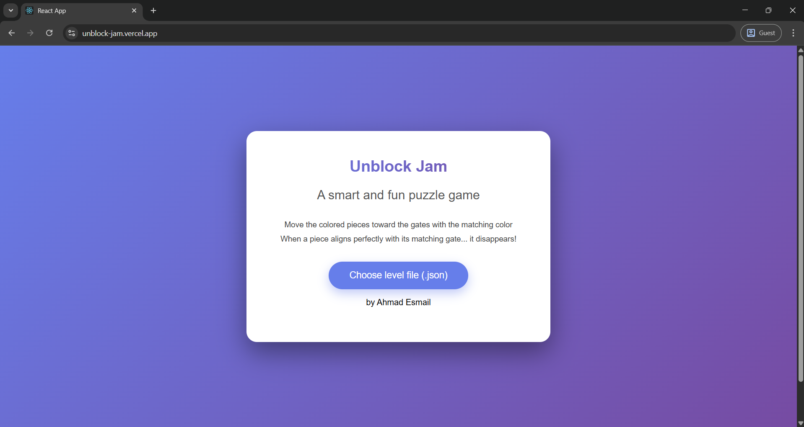
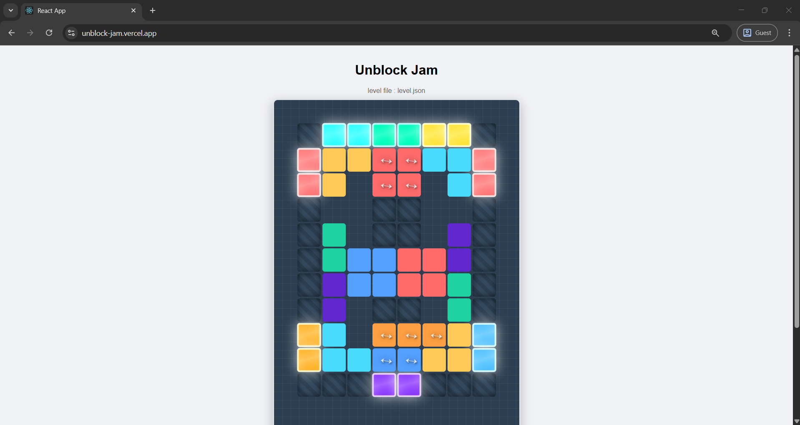
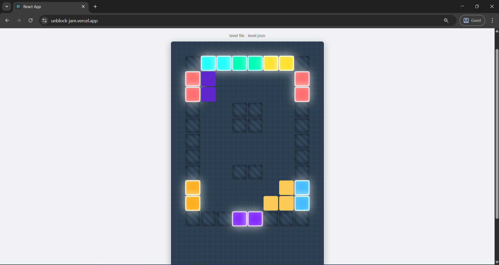
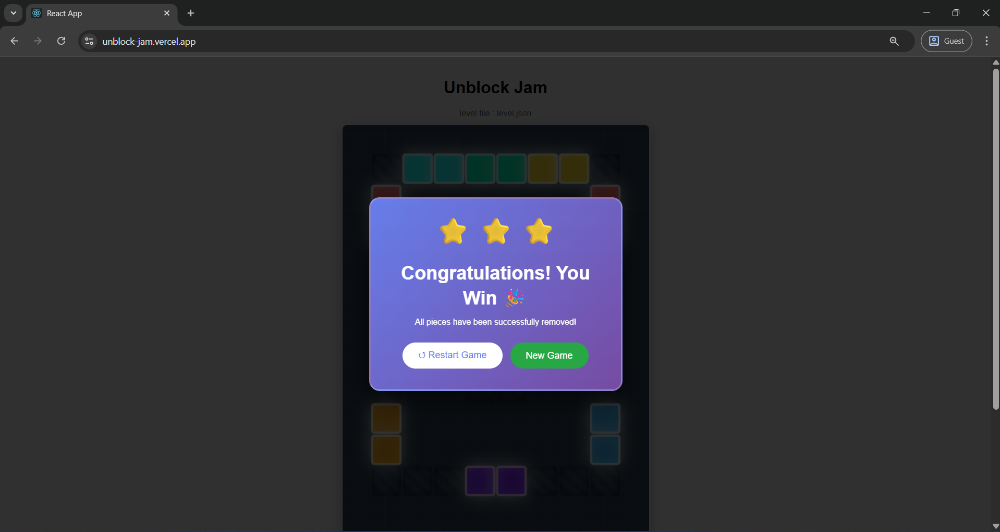

# 🎮 Unblock Jam – React JS Puzzle Game

Unblock Jam is an interactive puzzle game built with **React.js**.  
Your goal is simple: **move the colored blocks to free the target block and clear the path!**

---

## 🌐 Live Demo  
👉 **https://unblock-jam.vercel.app/**

---

## 🖼️ Screenshots

<div style="display: flex; flex-wrap: wrap; gap: 5px; justify-content: center;">
    
    
    
    
</div>

---

## 🚀 Features
- 🎨 Colorful block-based puzzle gameplay  
- 🧩 Grid system with movable and direction-locked blocks  
- ⚡ Smooth block dragging system  
- 📦 Levels loaded from external JSON file  
- 📱 Fully responsive UI  

---

## 📦 Running the Project Locally

### 1️⃣ Clone the repository
```bash
git clone https://github.com/AhmadEsmaill/Unblock_Jam_React_JS.git
cd Unblock_Jam_React_JS
```

### 2️⃣ Install dependencies
```bash
npm install
```

### 3️⃣ Start the development server
```bash
npm start
```

Your app will be available at:
```
http://localhost:3000
```

---

## 📂 Loading Levels (Required Before Playing)

The game loads level data at startup from:

```
public/level.json
```

This JSON must exist for the game to function.

### Example structure:
```json
{
  "levels": [
    {
      "id": 1,
      "name": "Beginner",
      "rows": 6,
      "cols": 6,
      "exit": { "row": 2, "col": 5 },
      "blocks": [
        { "id": "A", "type": "target", "row": 2, "col": 0, "length": 2, "orientation": "horizontal" },
        { "id": "B", "type": "block", "row": 0, "col": 0, "length": 3, "orientation": "vertical" },
        { "id": "C", "type": "block", "row": 3, "col": 2, "length": 2, "orientation": "horizontal" }
      ]
    }
  ]
}
```

You can edit this file to create new levels or adjust the puzzle layout.

---

## 🎯 How to Play

👉 **Goal:** Move the target block to the exit.

### Rules:
- Blocks move **only in their allowed direction**:  
  - Horizontal blocks → left/right  
  - Vertical blocks → up/down  
- Empty spaces allow sliding  
- Rearrange blocks strategically to clear a path

🎉 You win when the target block reaches the exit!

---

## 🛠️ Tech Stack
- ⚛️ React.js (Hooks)
- 🧩 Custom block & movement logic
- 🎨 CSS-based UI

---

## 🤝 Contribute
Pull requests are welcome!  
Feel free to improve code, add new levels, or enhance UI/UX.

---

## 📜 License
This project is open-source under the **MIT License**.
